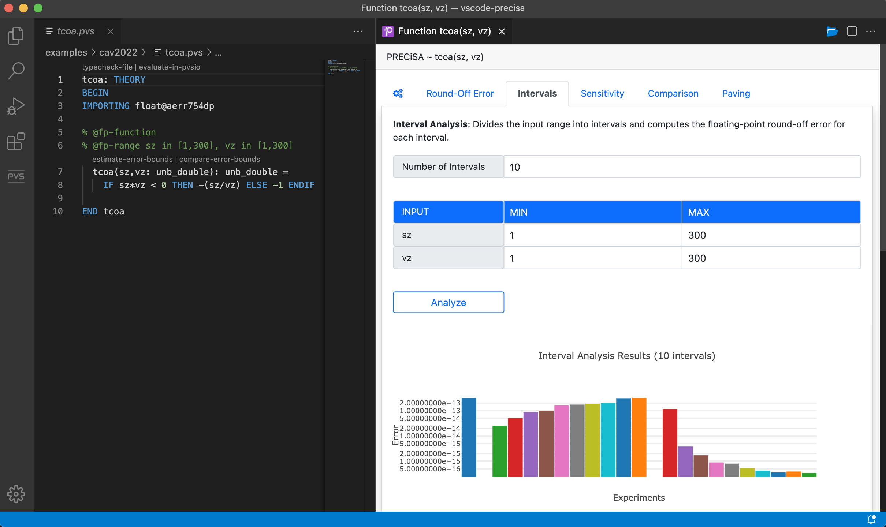
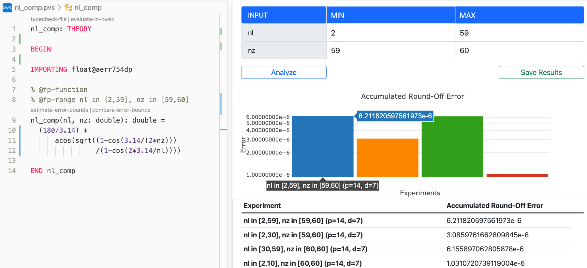
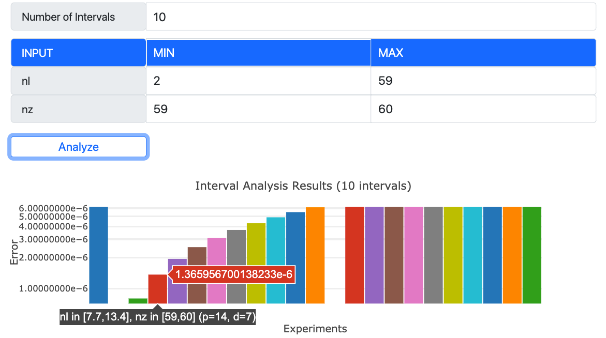
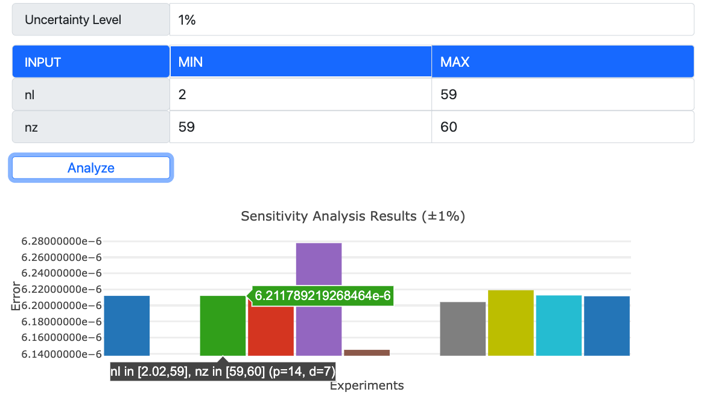
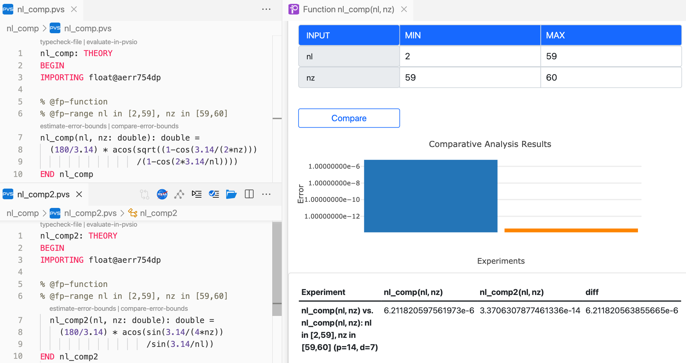
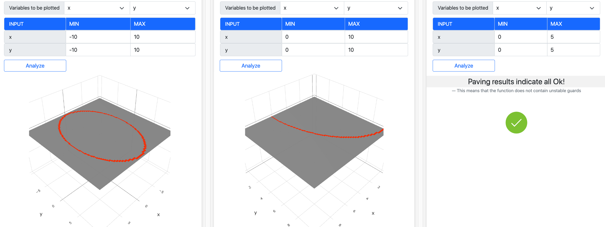

# VSCode-PRECiSA: Integration of PRECiSA in Visual Studio Code

VSCode-PRECiSA is a toolkit that integrates the PRECiSA floating-point round-off error analyzer into Visual Studio Code. The toolkit provides an intuitive graphical user interface and offers different analysis views for experimenting and reasoning about how floating-point errors affect the computed result of a program.

    

## Documentation
- [VSCode-PRECiSA User Manual](vscode-precisa/docs/vscode-precisa-user-manual.md)

## Requirements
- NodeJS (v16.13.0 or greater) https://nodejs.org/en/download
- Visual Studio Code (v1.49.0 or greater) https://code.visualstudio.com
- PRECiSA Static Analyzer https://github.com/nasa/PRECiSA

## Installation instructions
1. Install PRECiSA from https://github.com/nasa/PRECiSA
2. Search `vscode-precisa` in the [Visual Studio Code Marketplace](https://marketplace.visualstudio.com) and select `install`
3. Open Visual Studio Code settings, search `precisa`, and set the path to the precisa executable and Kodiak library

## Updating VSCode-PRECiSA
VSCode-PRECiSA is automatically updated every time we publish a new release in the marketplace. All settings and preferences will be maintained when installing a new release.

## Functionalities
The toolkit offers five main analysis views for experimenting and reasoning about floating-point errors in a program. 

- **Round-off error analysis view.** This view can be used to compute a sound estimation of the floating-point round-off error in a function for a given range of input values, and visualize the results in a bar chart.
   

- **Interval analysis view.** This view can be used to gain a better understanding of how the round-off error varies within the given range of input values.
   

- **Sensitivity analysis view.** This view can be used to evaluate the floating-point round-off error of a function when the range of input values is affected by a given uncertainty coefficient.
   

- **Comparative analysis view.** This view can be used to assess the round-off error in two alternative implementations of an algorithm.
   

- **Conditional instability analysis view.** This view conveys visual information about which combinations of input variables could alter the control flow of conditional statements used in a floating-point function.
   

  

## Examples
Example programs that can be analyzed with VSCode-PRECiSA can be found in the [examples](vscode-precisa/examples) folder and at https://github.com/nasa/PRECiSA/tree/master/benchmarks/analysis

  

## Notices
### Copyright 
Copyright 2022 United States Government as represented by the Administrator of the National Aeronautics and Space Administration. All Rights Reserved.
 
### Disclaimers
**No Warranty**: THE SUBJECT SOFTWARE IS PROVIDED "AS IS" WITHOUT ANY
  WARRANTY OF ANY KIND, EITHER EXPRESSED, IMPLIED, OR STATUTORY,
  INCLUDING, BUT NOT LIMITED TO, ANY WARRANTY THAT THE SUBJECT SOFTWARE
  WILL CONFORM TO SPECIFICATIONS, ANY IMPLIED WARRANTIES OF
  MERCHANTABILITY, FITNESS FOR A PARTICULAR PURPOSE, OR FREEDOM FROM
  INFRINGEMENT, ANY WARRANTY THAT THE SUBJECT SOFTWARE WILL BE ERROR
  FREE, OR ANY WARRANTY THAT DOCUMENTATION, IF PROVIDED, WILL CONFORM TO
  THE SUBJECT SOFTWARE. THIS AGREEMENT DOES NOT, IN ANY MANNER,
  CONSTITUTE AN ENDORSEMENT BY GOVERNMENT AGENCY OR ANY PRIOR RECIPIENT
  OF ANY RESULTS, RESULTING DESIGNS, HARDWARE, SOFTWARE PRODUCTS OR ANY
  OTHER APPLICATIONS RESULTING FROM USE OF THE SUBJECT SOFTWARE.
  FURTHER, GOVERNMENT AGENCY DISCLAIMS ALL WARRANTIES AND LIABILITIES
  REGARDING THIRD-PARTY SOFTWARE, IF PRESENT IN THE ORIGINAL SOFTWARE,
  AND DISTRIBUTES IT "AS IS."
 
**Waiver and Indemnity**: RECIPIENT AGREES TO WAIVE ANY AND ALL CLAIMS
  AGAINST THE UNITED STATES GOVERNMENT, ITS CONTRACTORS AND
  SUBCONTRACTORS, AS WELL AS ANY PRIOR RECIPIENT.  IF RECIPIENT'S USE OF
  THE SUBJECT SOFTWARE RESULTS IN ANY LIABILITIES, DEMANDS, DAMAGES,
  EXPENSES OR LOSSES ARISING FROM SUCH USE, INCLUDING ANY DAMAGES FROM
  PRODUCTS BASED ON, OR RESULTING FROM, RECIPIENT'S USE OF THE SUBJECT
  SOFTWARE, RECIPIENT SHALL INDEMNIFY AND HOLD HARMLESS THE UNITED
  STATES GOVERNMENT, ITS CONTRACTORS AND SUBCONTRACTORS, AS WELL AS ANY
  PRIOR RECIPIENT, TO THE EXTENT PERMITTED BY LAW.  RECIPIENT'S SOLE
  REMEDY FOR ANY SUCH MATTER SHALL BE THE IMMEDIATE, UNILATERAL
  TERMINATION OF THIS AGREEMENT.

## Contacts
* Paolo Masci ([paolo.masci@nianet.org](mailto:paolo.masci@nianet.org)) (for VSCode-PRECiSA)
* Laura Titolo ([laura.titolo@nianet.org](mailto:laura.titolo@nianet.org)) (for PRECiSA)
* Aaron Dutle ([aaron.m.dutle@nasa.gov](mailto:aaron.m.dutle@nasa.gov)) (for VSCode-PRECiSA at NASA)

