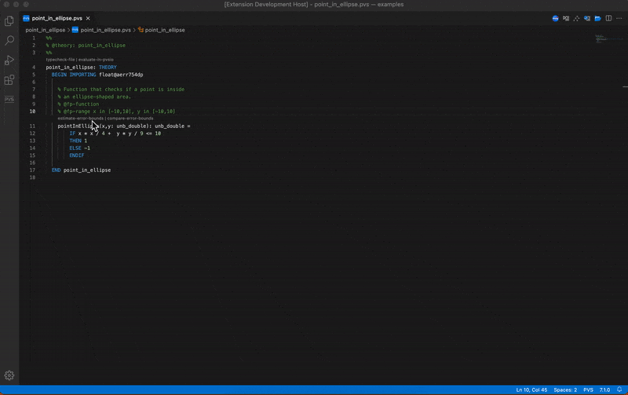
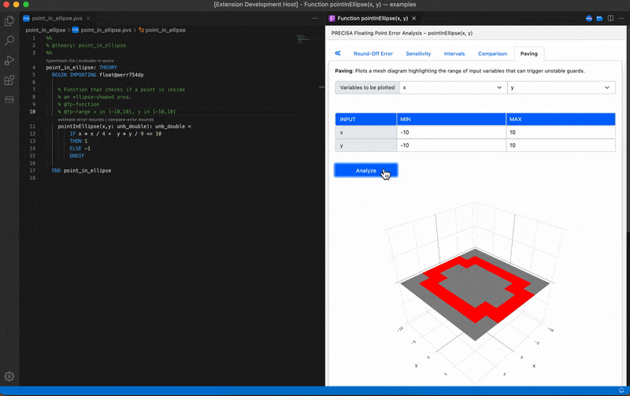

# VSCode-PRECiSA User Manual
This document illustrates how to perform the analysis of a floating-point program in VSCode-PRECiSA. Programs must be written in the language of the [PVS verification system](http://pvs.csl.sri.com/doc/pvs-language-reference.pdf).

# Pre-requisites
- [VSCode-PRECiSA](../README.md#installation-instructions) and all [required dependencies](../README.md#requirements) installed and enabled in Visual Studio Code (required)
- [VSCode-PVS](https://github.com/nasa/vscode-pvs) extension installed in Visual Studio Code (recommended)

## Steps to perform the analysis in VSCode-PRECiSA
1. Open a floating-point program.
2. Add a comment `@fp-function` in the floating-point program, at the line above a function to be analyzed. Two inline commands `estimate-error-bounds` and `compare-error-bounds` will be automatically created. 
3. Click `estimate-error-bounds` to launch VSCode-PRECiSA.
4. Use the views provided by VSCode-PRECiSA to perform the analysis.

## Examples
Example programs can be found in the [examples](../examples) and [analysis](https://github.com/nasa/PRECiSA/tree/master/benchmarks/analysis) folders.

### Example 1: Compact Position Reporting (CPR) algorithm
The Compact Position Reporting (CPR) algorithm is responsible for the encoding and decoding of aircraft positions in the Automatic Dependent Surveillance - Broadcast (ADS-B) protocol.

CPR uses a function `nl_comp` to subdivide the globe into equally sized zones which are used to locate the position of an aircraft. Given the number of longitude zones (nl) and the number of latitude zones (nz), function `nl_comp` computes the lower limit latitude of a longitude zone indexed by nl:

```pvs
nl_comp(nl, nz: unb_double): unb_double =  
    (180/3.14) 
        * acos( sqrt( (1 - cos(3.14 / (2 * nz)))
                        / (1 - cos(2 * 3.14 / nl))))
```
> Download link: [nl_comp.pvs](../examples/CPR/nl_comp.pvs)

<br>

To perform the analysis of `nl_comp` in VSCode-PRECiSA:
- Open [nl_comp.pvs](../examples/CPR/nl_comp.pvs) in Visual Studio Code.
- Add a comment `@fp-function` at the line above the function definition.
- Click `estimate-error-bounds` to launch VSCode-PRECiSA for that function.
- Use the views provided by VSCode-PRECiSA to perform the analysis.

<br>

### Example 2: Simplified CPR
An alternative definition of the `nl_function` is as follows:

```pvs
nl_comp2(nl, nz: unb_double): unb_double =  
    (180/3.14) 
        * acos( sin(3.14 / (4 * nz)) / sin(3.14 / nl) )
```
> Download link: [nl_comp2.pvs](../examples/CPR/nl_comp2.pvs)

<br>

To compare `nl_comp2` with `nl_comp` in VSCode-PRECiSA:
- Open [nl_comp2.pvs](../examples/CPR/nl_comp2.pvs) in Visual Studio Code.
- Add a comment `@fp-function` at the line above the function definition.
- While the VSCode-PRECiSA instance for the analysis of `nl_comp` is still open, click `compare-error-bounds` to load `nl_comp2` in the comparison analysis view.
- Click `Analyze` to perform the comparative analysis.

### Example 3: Point-in-ellipse
The following function checks if a point is inside an ellipse-shaped area.

```pvs
pointInEllipse(x,y: unb_double): unb_double = 
    IF x * x / 4 +  y * y / 9 <= 10
    THEN 1
    ELSE -1
    ENDIF
```
> Download link: [point_in_ellipse.pvs](../examples/point_in_ellipse/point_in_ellipse.pvs)

<br>

To analyze which combinations of input variables could alter the control flow of conditional statements used in a floating-point function:
- Open [point_in_ellipsenl.pvs](../examples/point_in_ellipse/point_in_ellipse.pvs) in Visual Studio Code.
- Add a comment `@fp-function` at the line above the function definition.
- Add a comment `@fp-range x in [-10,10], y in [-10,10]` to set the pre-defined range of input variables
- Click `estimate-error-bounds` to launch VSCode-PRECiSA for that function.
- Select the `Paving` view and click `Analyze` to perform the instability analysis.
<br><br> 

<br>

To perform a finer-grain analysis:
- Click the `settings` tab in VSCode-PRECiSA
- Increase `depth` to `16` 
- Select again the `Paving` view and click `Analyze`
<br><br> 


